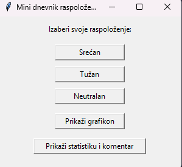
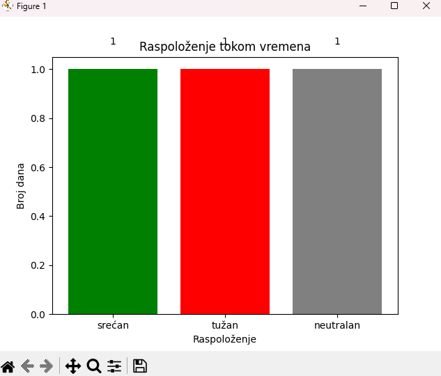

# Mini dnevnik raspoloženja

Ovo je jednostavan Python program koji beleži dnevno raspoloženje korisnika, prikazuje prethodne unose, statistiku i grafikon.

## Screenshot




## Kako pokrenuti
1. Instaliraj Python 3
2. Instaliraj matplotlib:
```bash
pip install matplotlib
